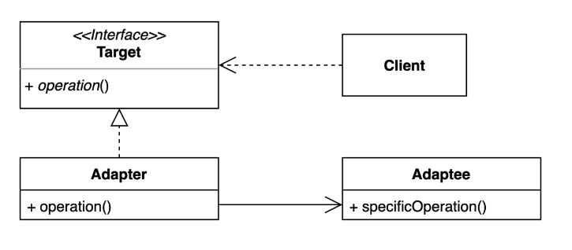

# 어댑터 패턴

콘센트 전압을 바꿔주는 어댑터를 생각하면 됨  
기존 코드를 클라이언트가 사용하는 구현체로 바꿔주는 패턴  
* 클라이언트가 사용하는 인터페이스를 따르지 않는 기존 코드를 재사용 할 수 있게 해준다.  

 


장점  
* 기존 코드를 변경하지 않아도 된다(OCP)  
* 기존 코드 하던 일과 특정 인터페이스 구현체로 변환하는 작업을 각기 다른 클래스로 분리하여 관리 (SRP)  

단점  
* 새로운 클래스 떄문에 복잡도가 증가할 수 있다.  

```kotlin:adpater.kt
package adpater

//접근하는 타겟
interface Target {
  fun specificMethod(data: Int)
}

// 사용하고자 하는 클래스
class Adaptee {
  fun method(data: Int) {
    println("실행되는 메소드 : $data")
  }
}

class Adapter(private val adaptee: Adaptee) : Target {
  override fun specificMethod(data: Int) {
    adaptee.method(data)
  }
}

fun main () {
  val service = Adapter(Adaptee())
  service.specificMethod(2)
}
```
