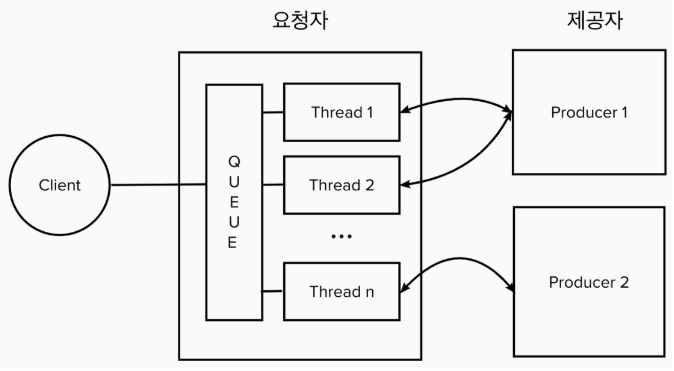

# 1. Spirng WebClient란?
Spring WEbClinet 는 웹으로 API 호출하기 위해 사용되는 Http Client 모듈 중 하나이다.  
기존에 JAVA에서 많이 사용하던 HttpClient는 RestTemplate가 있었지만 Rest Template는 Blocking 방식이고 WebCLinet는 Non-Blocking 방식이다.  
**Blocking** : 응답이 올 때까지 기다리는 방식  
**Non-Blocking** : 요청을 하고 나중에 응답이 올 때 껼과를 읽어 처리하는 방식  

 

# 2. RestTemplate와 WebClient 비교
Spring WebClient 동작 방식을 이해하기 위해서는 RestTemplate의 동작원리를 이해해야 한다.  

 **RestTemplate**  
</img>

Request는 먼저 Queue에 쌓이고 가용한 스레드가 있으면 그 스레드에 할당되어 처리된다.  
즉 , 1요청 당 1 스레드가 할당
